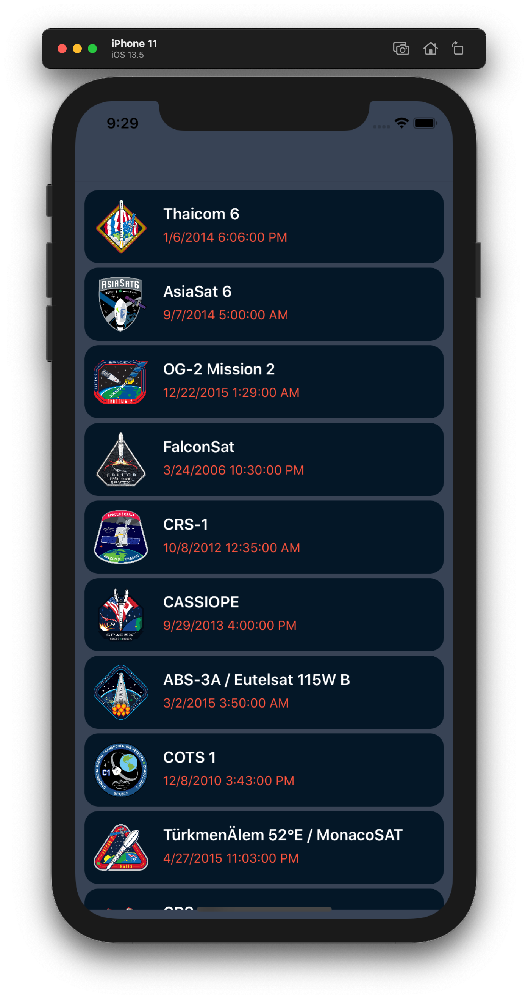
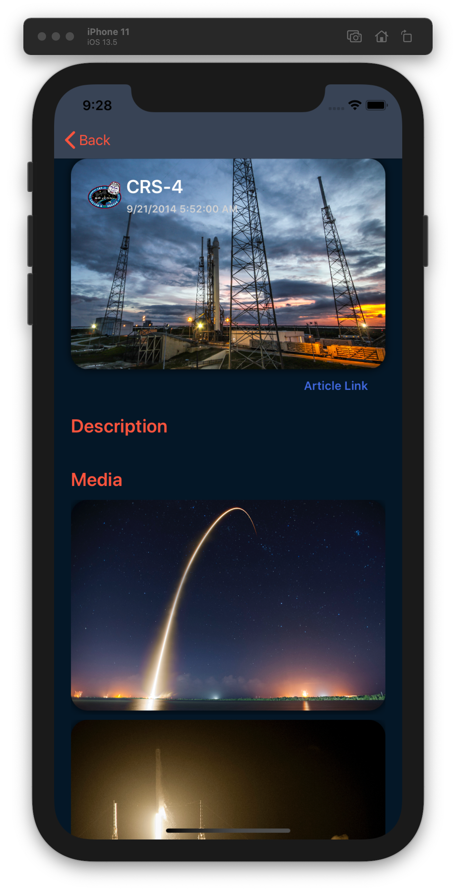
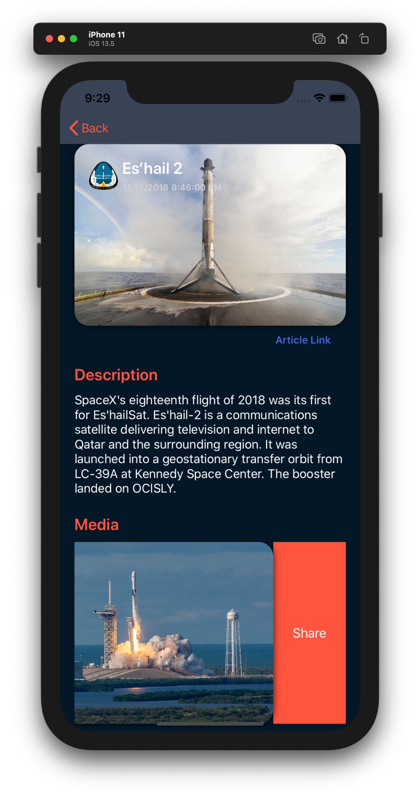

### SpaceX GraphQL Sample App

A little playground app to show off the SpaceX GrapQL API 🚀 - written in vanilla Xamarin.Forms

Dev.to Article https://dev.to/mariusmuntean/explore-the-spacex-graphql-api-by-building-a-xamarin-forms-app-424

Check out the code and I hope you'll have fun with your new knowledge!

As always, you're free to mess around with the code as you please 😉

This is what the app looks like

